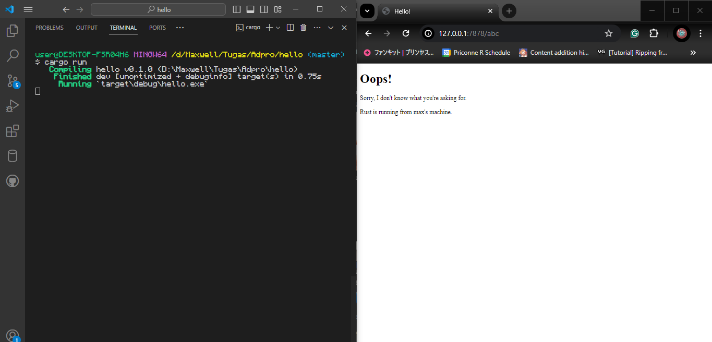

# Reflection Module 6

- [Commit 1](#commit-1-reflection-notes)
- [Commit 2](#commit-2-reflection-notes)
- [Commit 3](#commit-3-reflection-notes)
- [Commit 4](#commit-4-reflection-notes)
- [Commit 5](#commit-5-reflection-notes)
- [Commit Bonus](#commit-bonus-reflection-notes)

## Commit 1 Reflection Notes
Function `handle_connection` yang ada di `main.rs` akan mencetak *raw HTTP Request* yang dikirimkan oleh pengguna (dalam kasus ini saya sendiri) yang menjumpai web server yang saya jalankan. Function tersebut menerima sebuah *mutable* `TcpStream` sebagai parameter, yang kemudian akan diberikan *reference* nya ke `BufReader`. Dengan `BufReader`, *HTTP Request* yang dikirimkan akan displit berdasarkan karakter *newline* dan atau CRLF, kemudian di lakukan `unwrap()` karena method `lines()` mengembalikan sebuah struktur `Result<String, Error>`. Hasil dari `unwrap()` ini akan diiterasikan semua dan diambil *value* nya selama baris sekarang bukanlah sebuah baris kosong. Hasil *parsing* ini merupakan sebuah `Vector` atau secara sederhana array yang panjangnya bisa diubah, kemudian dicetak ke layar.

## Commit 2 Reflection Notes
Function `handle_connection` yang baru akan mengirimkan *raw HTTP Response* dengan status `200 OK`. Di dalam respon tersebut, akan dicantumkan data `HTML` agar jika *HTTP Request* dikirimkan dari sebuah browser, orang yang mengirimkannya dapat melihat respon dari server secara langsung di browser. Untuk mengirimkan data `HTML` itu dalam respon, diperlukan juga header `Content-Length` di *HTTP Response* nya agar browser tau sepanjang apa *body* dari respon yang dikirimkan server. Berikut adalah *screenshot* hasil menjalankan kode baru.

## Commit 3 Reflection Notes
Setelah di modifikasi lagi, function `handle_connection` sekarang akan mengirimkan *raw HTTP Response* berdasarkan status *HTTP Request* yang diterima. Ketika *HTTP Request* yang dikirim merupakan `GET Request`, URI yang diminta adalah `/`, serta versi HTTP `HTTP/1.1`, server akan mengembalikan HTML `hello.html`. Di lain sisi, jika *request* yang dikirim selain dari yang telah dijelaskan sebelumnya, server akan mengembalikan HTML `404.html`. Cara untuk membedakan cukup simpel, yaitu ambil saja baris pertama dari *raw HTTP Request* yang didapatkan lalu langsung di cek apakah sama dengan string `GET / HTTP/1.1` atau tidak. Yang dilakukan function `handle_connection` ini sekarang sudah mirip seperti *routing*, tergantung dari *request* yang di buat, server akan mengembalikan halaman HTML yang terkait. Namun, ketika pertama membuat kode ini dengan mengikuti Chapter 20 dari buku yang terkait, terdapat duplikasi kode yang sangat jelas terlihat, yaitu di bagian *conditional* untuk melihat apakah *request* yang dikirimkan akan mengembalikan HTML `hello.html` atau tidak. Oleh karena itu, kode tersebut harus di *refactor* agar duplikasi tersebut bisa dihilangkan. Saya mengikuti langkah-langkah *refactoring* yang terdapat dalam buku, yang mengeluarkan `status_line` serta nama file HTML yang akan dikembalikan untuk di *assign* valuenya berdasarkan hasil *request* yang diterima. Cara *assignment* ini mirip dengan ternary operator namun lebih *verbose*.

## Commit 4 Reflection Notes
Dengan kode `handle_connection` yang dimodifikasi untuk menangkap juga `GET Request` ke URI `/sleep`, ketika seseorang me-*request* URI tersebut dan ada orang lain yang ingin mengakses URI `/`, orang lain ini harus menunggu hingga orang pertama mendapatkan respon dari server baru ia akan mendapatkan respon dari server. Kejadian tersebut terjadi karena function `handle_connection` yang bertugas membaca *request* dan mengirimkan respon berjalan secara *single-threaded*. Ini menyebabkan ketika ada bagian kode di function `handle_connection` yang membutuhkan waktu yang lumayan lama untuk di jalankan, *request-request* lain yang datang dalam waktu tersebut harus menunggu function `handle_connection` sepenuhnya selesai berjalan. Dalam kasus ini, ketika ada orang yang meminta URI `/sleep`, function `handle_connection` akan "tidur" selama 10 detik lalu baru mengembalikan respon dengan data HTML dari `hello.html`, sehingga jika ada orang lain yang meminta URI lain, mereka harus menunggu orang yang meminta URI `/sleep` untuk mendapat jawaban dari server. Ketika ada banyak orang yang meminta URI `/sleep`, ini tentu akan menjadi sangat lambat untuk orang yang menginginkan URI lain.

## Commit 5 Reflection Notes
Function `handle_connection` sekarang tidak berjalan secara *single-threaded* lagi dengan bantuan *struct* `ThreadPool`. *Struct* `ThreadPool` merupakan sebuah *struct* yang mengandung beberapa `Worker` dan `Sender` yang akan digunakan untuk mengeksekusi function `handle_connection` ketika ada *connection* yang masuk. `Sender` yang tersimpan dalam `ThreadPool` akan digunakan untuk mengirimkan `Job` yang harus di kerjakan oleh sebuah `Worker`. `Job` disini secara umum me-*refer* kepada sebuah function yang akan mengkonsumsi parameternya sehingga hanya bisa dipanggil sekali dengan parameter tersebut dan bersifat aman untuk dikirimkan ke *thread-thread* lain selain *main thread*. Pada *struct* `ThreadPool` terdapat function `execute` yang bertugas untuk mengirimkan function yang diberikan sebagai parameter dari function `execute` ke sebuah `Sender`, yang kemudian dikirimkan lagi ke sebuah `Worker` melalui `Sender`. Setiap `Worker` yang dibuat pada `ThreadPool` memiliki sebuah `Receiver` yang berkorespondensi dengan sebuah `Sender` untuk menerima `Job` yang dikirimkan oleh `Sender`. `Receiver` ini juga di masukkan ke dalam sebuah `Arc` dan `Mutex` sehingga `Receiver` dapat dimiliki oleh banyak `Worker` namun hanya akan ada satu `Worker` yang menerima `Job` dari sebuah `Receiver` dalam suatu waktu. Ketika `Worker` menerima sebuah `Job`, *thread* dimana `Worker` tersebut berada akan dikunci sehingga `Worker` ini tidak dapat menerima `Job` lain di saat yang sama, lalu `Worker` akan mengambil `Job` yang dikirimkan dan mengeksekusinya. Setelah eksekusi selesai, *thread* akan dibuka kembali agar `Worker` dapat menerima `Job` baru. Ini semua membuat ketika ada suatu *request* yang membutuhkan waktu yang lama untuk di proses, *request-request* lain yang terjadi di waktu yang sama tidak perlu menunggu satu *request* ini mendapatkan sebuah respon, melainkan bisa menggunakan *thread* lain yang dimiliki server (dalam kasus ini ada 4 *thread* sehingga *at-most* akan dapat memproses 4 *request* secara bersamaan).

## Commit Bonus Reflection Notes
Perbedaan utama function `build` yang saya buat dengan function `new` di awal terletak pada *error handling*nya. Function `build` akan mengembalikan data dengan tipe `Result<ThreadPool, PoolCreationError>`, yang berarti function tersebut bisa mengembalikan objek `ThreadPool` jika function berhasil berjalan, atau akan mengembalikan error dengan tipe `PoolCreationError` jika terjadi sesuatu yang tidak sesuai. Oleh karena itu, jika dalam membuat `ThreadPool` digunakan function `build`, error yang terjadi masih dapat di handle di dalam program tanpa harus memberhentikan program. Di lain sisi, pada function `new`, data yang dikembalikan akan langsung berupa objek `ThreadPool`. Ketika ada error yang terjadi, function `new` akan langsung "panic", yang tidak dapat di handle dalam program sehingga akan memberhentikan program, dan program harus dijalankan ulang setelah errornya diperbaiki.
