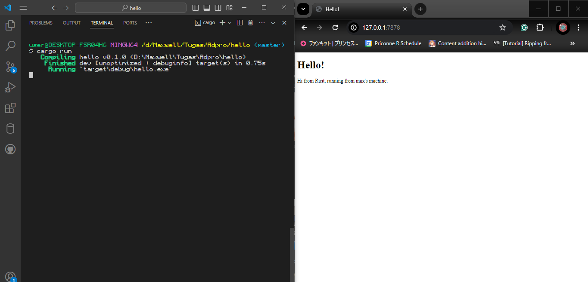

# Reflection Module 6

- [Commit 1](#commit-1-reflection-notes)

## Commit 1 Reflection Notes
Function `handle_connection` yang ada di `main.rs` akan mencetak *raw HTTP Request* yang dikirimkan oleh pengguna (dalam kasus ini saya sendiri) yang menjumpai web server yang saya jalankan. Function tersebut menerima sebuah *mutable* `TcpStream` sebagai parameter, yang kemudian akan diberikan *reference* nya ke `BufReader`. Dengan `BufReader`, *HTTP Request* yang dikirimkan akan displit berdasarkan karakter *newline* dan atau CRLF, kemudian di lakukan `unwrap()` karena method `lines()` mengembalikan sebuah struktur `Result<String, Error>`. Hasil dari `unwrap()` ini akan diiterasikan semua dan diambil *value* nya selama baris sekarang bukanlah sebuah baris kosong. Hasil *parsing* ini merupakan sebuah `Vector` atau secara sederhana array yang panjangnya bisa diubah, kemudian dicetak ke layar.

## Commit 2 Reflection Notes
Function `handle_connection` yang baru akan mengirimkan *raw HTTP Response* dengan status `200 OK`. Di dalam respon tersebut, akan dicantumkan data `HTML` agar jika *HTTP Request* dikirimkan dari sebuah browser, orang yang mengirimkannya dapat melihat respon dari server secara langsung di browser. Untuk mengirimkan data `HTML` itu dalam respon, diperlukan juga header `Content-Length` di *HTTP Response* nya agar browser tau sepanjang apa *body* dari respon yang dikirimkan server. Berikut adalah *screenshot* hasil menjalankan kode baru.

